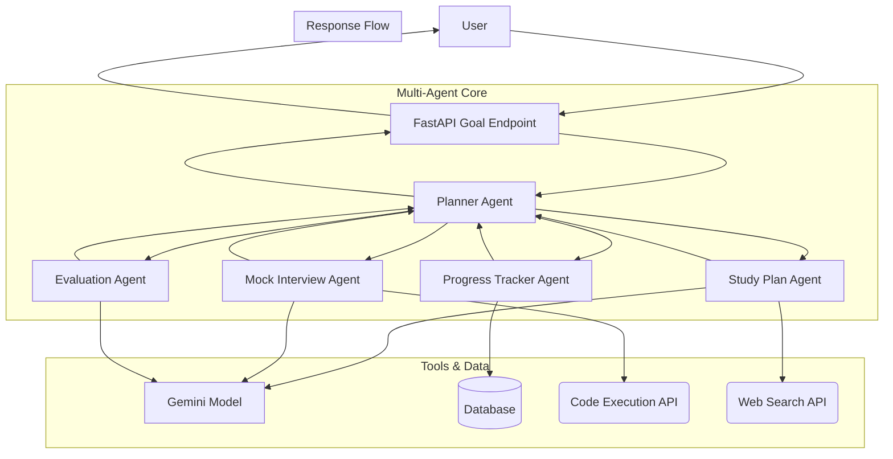

# 🎯 Interview Preparation Agent — Full System Design (Enhanced)

---

## 🧠 1. High-Level Overview

The system is a **multi-agent AI assistant** that provides a comprehensive, end-to-end interview preparation experience by:

*   Generating personalized study plans.
*   Conducting interactive mock interviews (behavioral and technical).
*   Evaluating user answers with detailed, actionable feedback.
*   Tracking progress and adapting to user performance over time.

It uses **modular, tool-using agents** coordinated by a central planner, powered by the **Gemini** model, and is designed for scalable deployment on **Google Cloud Run**.

---

# 🏗️ 2. System Architecture

## 🔹 Components

### 🧑 User Layer

*   Web / Mobile / API client.
*   Sends natural language goals (e.g., "I want to practice Python coding questions," "Create a 5-day study plan for a data science role").

---

### 🌐 API Layer

*   A single, goal-oriented endpoint built using **FastAPI**.
*   Handles input validation, user authentication, and routes goals to the Planner Agent.

---

### 🧠 Multi-Agent Layer (Core)

| Agent                  | Responsibility                                                        |
| ---------------------- | ----------------------------------------------------------------------- |
| **Planner Agent**      | Decomposes the user's goal into a logical sequence of tasks for other agents. |
| **Study Plan Agent**   | Generates structured, day-wise study plans based on role and timeline.      |
| **Mock Interview Agent** | Manages the mock interview flow, generating questions and maintaining context. |
| **Evaluation Agent**   | Assesses user responses against defined rubrics and provides feedback.      |
| **Progress Tracker Agent** | Stores and retrieves user performance data, scores, and completed topics. |

---

### 🔧 External Tools & Services Layer

*   A layer for managing connections to optional external services to enrich the user experience.
*   **Integrations (Examples):**
    *   **Web Search API:** To fetch recent articles about a company or the latest definitions for technical terms.
    *   **Code Execution API:** A sandboxed environment to run and test user-written code for technical challenges.

---

### 💾 Data Layer

*   Stores study plans, user answers, scores, and performance history.
*   **Database:** **Firestore** or **AlloyDB** for structured, persistent storage.

---

### 🤖 Model Layer

*   **Gemini Model** provides the core intelligence for reasoning, planning, content generation, and evaluation.

---

## 📊 Architecture Diagram (Mermaid)



---

# ⚙️ 3. Goal-Oriented API Design

The system uses a single, powerful endpoint to simplify interaction and increase flexibility.

```http
POST /execute-goal
```

**Example 1: Create a Study Plan**

```json
{
  "goal": "create-study-plan",
  "params": {
    "role": "Python Backend Developer",
    "days": 5
  }
}
```

**Example 2: Start a Mock Interview**

```json
{
  "goal": "start-mock-interview",
  "params": {
    "topic": "system-design",
    "difficulty": "medium"
  }
}
```

**Example 3: Evaluate an Answer**

```json
{
  "goal": "evaluate-answer",
  "params": {
    "question": "How would you design a URL shortener?",
    "answer": "I would use a hash map in memory to start..."
  }
}
```

---

# 🧠 4. Agent & Tool Design

Each agent is a specialized worker that uses a set of "tools" to accomplish its tasks.

*   **Planner Agent**
    *   **Tools:** None. It uses the Gemini model to reason and create plans.

*   **Study Plan Agent**
    *   **Tools:**
        *   `generate_plan(role, days)`: Prompts the model to create a study schedule.
        *   `find_resources(topic)`: Uses the **Web Search API** to find relevant articles or tutorials.

*   **Mock Interview Agent**
    *   **Tools:**
        *   `generate_question(topic, difficulty)`: Prompts the model for a relevant question.
        *   `execute_code(code, language)`: Uses the **Code Execution API** to evaluate a coding answer.

*   **Evaluation Agent**
    *   **Tools:**
        *   `score_answer(question, answer, rubric)`: Prompts the model to provide a score and feedback.

*   **Progress Tracker Agent**
    *   **Tools:**
        *   `save_progress(userId, data)`: Writes performance data to the database.
        *   `get_progress(userId)`: Reads performance data from the database.

---

# 🎯 5. Key Design Decisions

### ✅ Goal-Oriented API

*   A single `/execute-goal` endpoint provides a flexible and extensible interface. New capabilities can be added without changing the API contract.

### ✅ Modular, Tool-Using Agents

*   Each agent has a clearly defined responsibility and a set of tools. This makes the system robust, testable, and easy to maintain.

### ✅ Centralized Orchestration

*   The **Planner Agent** acts as the "brain," creating clear, auditable plans and preventing chaotic agent interactions.

---

# 🚀 6. Scalability & Future Enhancements

*   **User Authentication:** Implement OAuth2 to manage user-specific history and progress securely.
*   **Company-Specific Prep:** Integrate the Web Search tool to fetch details about a specific company (e.g., their values, recent news) to tailor behavioral questions.
*   **Voice-Based Interviews:** Add a voice interface using speech-to-text and text-to-speech APIs.
*   **Rich Skill Library:** Develop more specialized "skills" (e.g., "SQL Playground," "System Design Whiteboard") that the Planner can incorporate into a session.

---

# 🧾 7. Final One-Liner

> A scalable, goal-oriented multi-agent AI system that orchestrates modular, tool-using agents to provide a comprehensive and interactive interview preparation experience.
